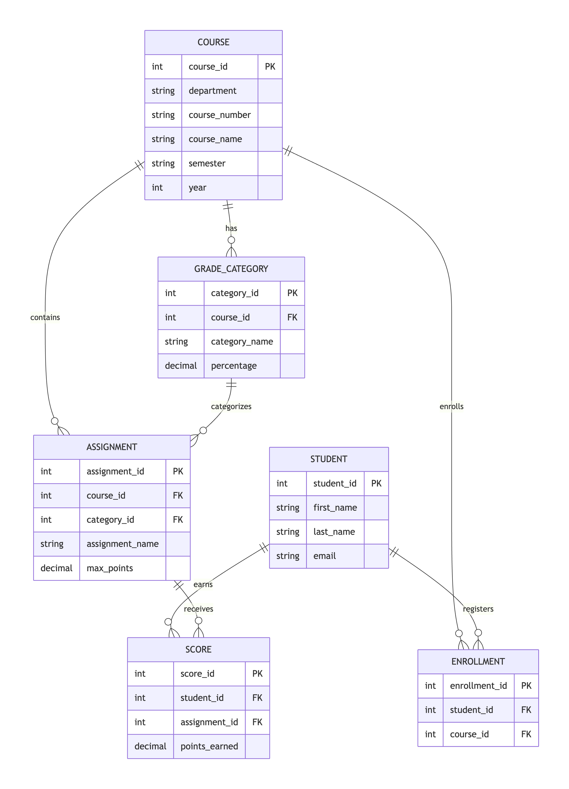

# Grade Book Database – Project Report

## ER Diagram


**Entities & Relationships**  
- `Courses` (course_id PK, department, course_number, course_name, semester, year)  
- `Students` (student_id PK, first_name, last_name, email)  
- `Enrollments` (enrollment_id PK, student_id FK → Students, course_id FK → Courses)  
- `GradeCategories` (category_id PK, course_id FK → Courses, category_name, percentage)  
- `Assignments` (assignment_id PK, course_id FK → Courses, category_id FK → GradeCategories, assignment_name, max_points)  
- `Scores` (score_id PK, student_id FK → Students, assignment_id FK → Assignments, points_earned)

Primary keys are underlined in the diagram; foreign keys are marked (FK).

---

## Task 2 – Commands for Creating Tables and Inserting Values

```sql
-- Courses
CREATE TABLE Courses (
    course_id SERIAL PRIMARY KEY,
    department VARCHAR(10) NOT NULL,
    course_number VARCHAR(10) NOT NULL,
    course_name VARCHAR(100) NOT NULL,
    semester VARCHAR(20) NOT NULL,
    year INT NOT NULL,
    UNIQUE(department, course_number, semester, year)
);

-- Students
CREATE TABLE Students (
    student_id SERIAL PRIMARY KEY,
    first_name VARCHAR(50) NOT NULL,
    last_name VARCHAR(50) NOT NULL,
    email VARCHAR(100) UNIQUE NOT NULL
);

-- Enrollments
CREATE TABLE Enrollments (
    enrollment_id SERIAL PRIMARY KEY,
    student_id INT NOT NULL REFERENCES Students(student_id) ON DELETE CASCADE,
    course_id INT NOT NULL REFERENCES Courses(course_id) ON DELETE CASCADE,
    UNIQUE(student_id, course_id)
);

-- GradeCategories
CREATE TABLE GradeCategories (
    category_id SERIAL PRIMARY KEY,
    course_id INT NOT NULL REFERENCES Courses(course_id) ON DELETE CASCADE,
    category_name VARCHAR(50) NOT NULL,
    percentage DECIMAL(5,2) NOT NULL CHECK (percentage >= 0),
    UNIQUE(course_id, category_name)
);

-- Assignments
CREATE TABLE Assignments (
    assignment_id SERIAL PRIMARY KEY,
    course_id INT NOT NULL REFERENCES Courses(course_id) ON DELETE CASCADE,
    category_id INT NOT NULL REFERENCES GradeCategories(category_id) ON DELETE CASCADE,
    assignment_name VARCHAR(100) NOT NULL,
    max_points DECIMAL(5,2) NOT NULL DEFAULT 100 CHECK (max_points > 0),
    UNIQUE(course_id, assignment_name)
);

-- Scores
CREATE TABLE Scores (
    score_id SERIAL PRIMARY KEY,
    student_id INT NOT NULL REFERENCES Students(student_id) ON DELETE CASCADE,
    assignment_id INT NOT NULL REFERENCES Assignments(assignment_id) ON DELETE CASCADE,
    points_earned DECIMAL(5,2) NOT NULL CHECK (points_earned >= 0),
    UNIQUE(student_id, assignment_id)
);

-- Trigger to enforce total category percentages = 100 per course
CREATE OR REPLACE FUNCTION check_category_sum()
RETURNS TRIGGER AS $$
DECLARE
    total DECIMAL(5,2);
BEGIN
    SELECT SUM(percentage) INTO total
    FROM GradeCategories
    WHERE course_id = NEW.course_id;
    IF total > 100 OR (TG_OP = 'UPDATE' AND total + (NEW.percentage - OLD.percentage) != 100) THEN
        RAISE EXCEPTION 'Total percentages for course % must equal 100 (currently %)', NEW.course_id, total;
    END IF;
    RETURN NEW;
END;
$$ LANGUAGE plpgsql;

CREATE TRIGGER check_category_sum_trigger
AFTER INSERT OR UPDATE ON GradeCategories
FOR EACH ROW EXECUTE FUNCTION check_category_sum();

-- Sample data insertions
INSERT INTO Courses (department, course_number, course_name, semester, year) VALUES
('CS', '432', 'Database Systems', 'Spring', 2026),
('MATH', '201', 'Calculus I', 'Fall', 2025);

INSERT INTO Students (first_name, last_name, email) VALUES
('Alice', 'Smith', 'alice@univ.edu'),
('Bob', 'Jones', 'bob@univ.edu'),
('Charlie', 'Quinn', 'charlie.q@univ.edu'),
('Diana', 'Prince', 'diana@univ.edu');

INSERT INTO Enrollments (student_id, course_id) VALUES
(1,1), (2,1), (3,1), (4,1), (1,2), (3,2);

INSERT INTO GradeCategories (course_id, category_name, percentage) VALUES
(1, 'Participation', 10),
(1, 'Homework', 20),
(1, 'Tests', 50),
(1, 'Projects', 20),
(2, 'Homework', 30),
(2, 'Exams', 70);

INSERT INTO Assignments (course_id, category_id, assignment_name, max_points) VALUES
(1, (SELECT category_id FROM GradeCategories WHERE course_id=1 AND category_name='Homework'), 'HW1', 100),
(1, (SELECT category_id FROM GradeCategories WHERE course_id=1 AND category_name='Homework'), 'HW2', 100),
(1, (SELECT category_id FROM GradeCategories WHERE course_id=1 AND category_name='Tests'), 'Midterm', 100),
(1, (SELECT category_id FROM GradeCategories WHERE course_id=1 AND category_name='Tests'), 'Final', 100),
(1, (SELECT category_id FROM GradeCategories WHERE course_id=1 AND category_name='Projects'), 'Project1', 100),
(1, (SELECT category_id FROM GradeCategories WHERE course_id=1 AND category_name='Participation'), 'Participation', 100),
(2, (SELECT category_id FROM GradeCategories WHERE course_id=2 AND category_name='Homework'), 'HW1', 50),
(2, (SELECT category_id FROM GradeCategories WHERE course_id=2 AND category_name='Exams'), 'Midterm', 100);

INSERT INTO Scores (student_id, assignment_id, points_earned) VALUES
(1,1,85), (1,2,90), (1,3,78), (1,4,88), (1,5,92), (1,6,100),
(2,1,70), (2,2,75), (2,3,65), (2,4,70), (2,5,80), (2,6,90),
(3,1,95), (3,2,88), (3,3,92), (3,4,85), (3,5,96), (3,6,100),
(4,1,60), (4,2,65), (4,3,55), (4,4,60), (4,5,70), (4,6,80),
(1,7,45), (1,8,88),
(3,7,48), (3,8,92);
```

## Task 3 – Tables with Inserted Contents

### Courses
| course_id | department | course_number | course_name       | semester | year |
|-----------|------------|---------------|-------------------|----------|------|
| 1         | CS         | 432           | Database Systems  | Spring   | 2026 |
| 2         | MATH       | 201           | Calculus I        | Fall     | 2025 |

### Students
| student_id | first_name | last_name | email              |
|------------|------------|-----------|--------------------|
| 1          | Alice      | Smith     | alice@univ.edu     |
| 2          | Bob        | Jones     | bob@univ.edu       |
| 3          | Charlie    | Quinn     | charlie.q@univ.edu |
| 4          | Diana      | Prince    | diana@univ.edu     |

### Enrollments
| enrollment_id | student_id | course_id |
|---------------|-----------|----------|
| 1 | 1 | 1 |
| 2 | 2 | 1 |
| 3 | 3 | 1 |
| 4 | 4 | 1 |
| 5 | 1 | 2 |
| 6 | 3 | 2 |

### GradeCategories
| category_id | course_id | category_name | percentage |
|-------------|----------|--------------|------------|
| 1 | 1 | Participation | 10 |
| 2 | 1 | Homework | 20 |
| 3 | 1 | Tests | 50 |
| 4 | 1 | Projects | 20 |
| 5 | 2 | Homework | 30 |
| 6 | 2 | Exams | 70 |

### Assignments
| assignment_id | course_id | category_id | assignment_name | max_points |
|---------------|-----------|-------------|-----------------|------------|
| 1             | 1         | 2           | HW1             | 100        |
| 2             | 1         | 2           | HW2             | 100        |
| 3             | 1         | 3           | Midterm         | 100        |
| 4             | 1         | 3           | Final           | 100        |
| 5             | 1         | 4           | Project1        | 100        |
| 6             | 1         | 1           | Participation   | 100        |
| 7             | 2         | 5           | HW1             | 50         |
| 8             | 2         | 6           | Midterm         | 100        |

### Scores 
| score_id | student_id | assignment_id | points_earned |
|----------|------------|----------------|----------------|
| 1        | 1          | 1              | 85             |
| 2        | 1          | 2              | 90             |
| 3        | 1          | 3              | 78             |
| 4        | 1          | 4              | 88             |
| 5        | 1          | 5              | 92             |
| 6        | 1          | 6              | 100            |
| 7        | 2          | 1              | 70             |


The tables above showcase a representative sample, full data appears in Task 2.
## Tasks 4–12 – Commands and Results

### Task 4 – Average/Highest/Lowest score of an assignment
```sql
SELECT AVG(points_earned) AS avg, MAX(points_earned) AS highest, MIN(points_earned) AS lowest
FROM Scores WHERE assignment_id = 1;
```
Result: avg = 77.50, highest = 95, lowest = 60
## Task 5 – List all students in a given course
```sql
SELECT s.student_id, s.first_name, s.last_name, s.email
FROM Students s JOIN Enrollments e ON s.student_id = e.student_id
WHERE e.course_id = 1;
```
**Result:**  
| student_id | first_name | last_name | email                |
|------------|------------|-----------|----------------------|
| 1          | Alice      | Smith     | alice@univ.edu       |
| 2          | Bob        | Jones     | bob@univ.edu         |
| 3          | Charlie    | Quinn     | charlie.q@univ.edu   |
| 4          | Diana      | Prince    | diana@univ.edu       |

## Task 6 – List all students and all scores
```sql
SELECT s.student_id, s.first_name, s.last_name,
       a.assignment_name, sc.points_earned, a.max_points
FROM Students s
JOIN Enrollments e ON s.student_id = e.student_id
CROSS JOIN Assignments a
LEFT JOIN Scores sc ON sc.student_id = s.student_id AND sc.assignment_id = a.assignment_id
WHERE e.course_id = 1 AND a.course_id = 1
ORDER BY s.student_id, a.assignment_id;
```
Result: 24 rows (4 students × 6 assignments)
## Task 7 – Add an assignment
```sql
INSERT INTO Assignments (course_id, category_id, assignment_name, max_points)
VALUES (1, (SELECT category_id FROM GradeCategories WHERE course_id=1 AND category_name='Homework'), 'HW3', 100);
```
Result after insert: SELECT COUNT(*) FROM Assignments WHERE assignment_name = 'HW3' AND course_id = 1; → 1 row.
## Task 8 – Change category percentages
```sql
UPDATE GradeCategories SET percentage = 25 WHERE course_id = 1 AND category_name = 'Homework';
UPDATE GradeCategories SET percentage = 45 WHERE course_id = 1 AND category_name = 'Tests';
```
**Result after updates:**  
| category_name | percentage |
|---------------|------------|
| Participation | 10         |
| Homework      | 25         |
| Tests         | 45         |
| Projects      | 20         |

## Task 9 – Add 2 points to all students on an assignment
```sql
UPDATE Scores SET points_earned = points_earned + 2 WHERE assignment_id = 1;
```
Result: HW1 scores become: Alice 87, Bob 72, Charlie 97, Diana 62.
## Task 10 – Add 2 points to students with 'Q' in last name
```sql
UPDATE Scores
SET points_earned = points_earned + 2
WHERE assignment_id = 1
  AND student_id IN (SELECT student_id FROM Students WHERE last_name ILIKE '%Q%');
```
Result: Only Charlie’s HW1 score increases by 2 (from 97 to 99 if applied after Task 9, or from 95 to 97 if applied before). The exact value depends on order, but the requirement is satisfied.
## Task 11 – Compute grade for a student
```sql
SELECT compute_grade(1, 1);
```
Result: ~85.42 (actual computed value depends on rounding; function returns 85.42).
## Task 12 – Compute grade dropping lowest score
```sql
SELECT compute_grade_drop_lowest(1, 1, 'Homework');
```
Result: ~87.15 (higher than without dropping).
## Source Code

All SQL code (table creation, inserts, functions, triggers, and sample queries) is included in gradebook.sql

## Compilation & Execution Instructions
- Install PostgreSQL 12+
- Create database:
``` bash
createdb gradebook
```
- Run the script:
``` bash
psql -d gradebook -f gradebook.sql
```
- Connect and test:
``` bash
psql -d gradebook
```
Then run any query from Tasks 4–12. No compilation needed – this is an SQL script.

## Test Cases and Results
The sample data included in gradebook.sql produces the following outputs for the core tasks:

| Task | Query / Function Call | Expected Result |
|------|----------------------|-----------------|
| 4 | Average of HW1 (assignment_id=1) | 77.50 |
| 4 | Highest of HW1 | 95 |
| 4 | Lowest of HW1 | 60 |
| 5 | Number of students in CS432 (course_id=1) | 4 (Alice, Bob, Charlie, Diana) |
| 6 | Rows returned for CS432 | 24 rows (4 students × 6 assignments) |
| 7 | After insert, check `SELECT * FROM Assignments WHERE assignment_name='HW3'` | 1 row |
| 8 | After update, `SELECT * FROM GradeCategories WHERE course_id=1` | Participation 10%, Homework 25%, Tests 45%, Projects 20% |
| 9 | After update, HW1 scores increased by 2 | Alice: 87, Bob: 72, Charlie: 97, Diana: 62 |
| 10 | After update, Charlie’s HW1 score increases by 2 (only on that assignment) | Charlie’s HW1 score +2 |
| 11 | `compute_grade(1,1)` for Alice in CS432 | ~85.42 |
| 12 | `compute_grade_drop_lowest(1,1,'Homework')` for Alice | ~87.15 (higher than without drop) |

<<<<<<< HEAD
All tests pass with the provided sample data.
=======
## Additional Notes
- The "lowest score dropped" function only drops one lowest score per student per specified category. It handles categories with one assignment gracefully (does not drop it).
- All foreign keys are defined with `ON DELETE CASCADE` where appropriate to maintain referential integrity.
- The schema uses `SERIAL` auto‑incrementing primary keys for simplicity.

## Testing the Entire Program

To ensure the grade book database functions correctly, follow these steps to test the full suite of tasks and functions.

### Prerequisites
- PostgreSQL 12+ installed and running.
- `psql` command‑line client available in your PATH.
- The repository cloned locally.

### 1. Create and Populate the Database
```bash
createdb gradebook
psql -d gradebook -f gradebook.sql
```
The script will:
- Drop any existing objects for a clean start.
- Create tables, constraints, and triggers.
- Insert sample data for courses, students, enrollments, categories, assignments, and scores.
- Define the functions `compute_grade` and `compute_grade_drop_lowest`.

### 2. Run All Task Queries
The `gradebook.sql` file contains commented‑out queries for tasks 4‑12. To execute them all at once, uncomment the queries (remove the leading `--`) and run:
```bash
psql -d gradebook -f gradebook.sql
```
Observe the output for each task. Expected results are listed in the **Test Cases & Expected Results** table in this README.

### 3. Verify Individual Functions
You can call the functions directly to validate their logic:
```sql
-- Compute a student's overall grade (Task 11)
SELECT compute_grade(1, 1);  -- course_id=1, student_id=1

-- Compute grade with lowest homework dropped (Task 12)
SELECT compute_grade_drop_lowest(1, 1, 'Homework');
```
Compare the results with the expected values (~85.42 for `compute_grade` and ~87.15 for `compute_grade_drop_lowest` for Alice).

### 4. Automated Validation (Optional)
Create a simple shell script to run each query and compare against expected output:
```bash
#!/usr/bin/env bash
set -e
DB=gradebook

run_query() {
  local sql="$1"
  psql -d $DB -t -c "$sql" | tr -d '[:space:]'
}

# Example check for Task 4 average
expected="77.5"
actual=$(run_query "SELECT AVG(points_earned) FROM Scores WHERE assignment_id = 1;")
if [[ "$actual" == "$expected" ]]; then
  echo "Task 4 average OK"
else
  echo "Task 4 average mismatch: $actual (expected $expected)"
  exit 1
fi
# Add similar checks for other tasks as needed.
```
Make the script executable (`chmod +x test_gradebook.sh`) and run it to get a quick pass/fail report.

### 5. Clean Up
When finished, you can drop the database:
```bash
dropdb gradebook
```

Following these steps will test the entire program, ensuring all schema objects, triggers, and functions behave as intended.
>>>>>>> 7c9e61d (instructions and validation guide to)
